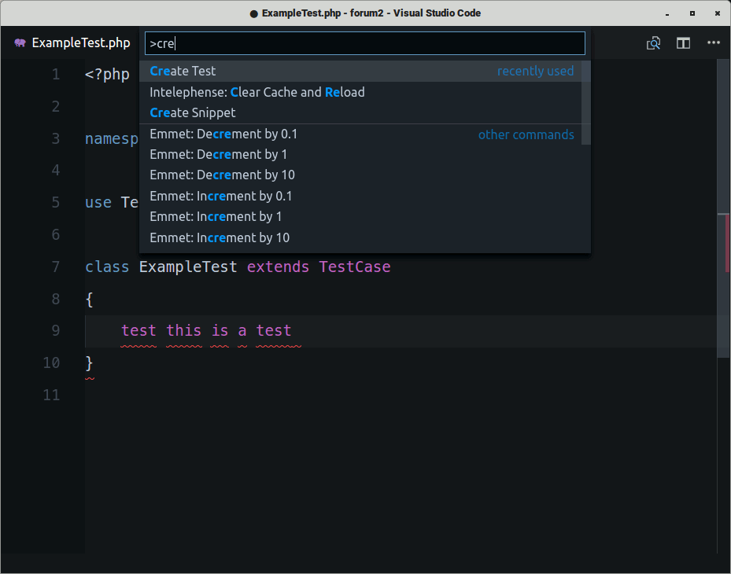

# PHP Test Creator README

Simple PHP Test Method Creator

## Features

Create a test method.

Type 'test ...' anywhere in your edtior.

Bring up the command palette, and select "Create Test".

## Requirements

None.

## Extension Settings

* `phpTestCreator.withoutExceptionHandling.visiblity`: show/hide withoutExceptionHandling

## Known Issues

None

## Release Notes

### 1.0.0

Initial release
