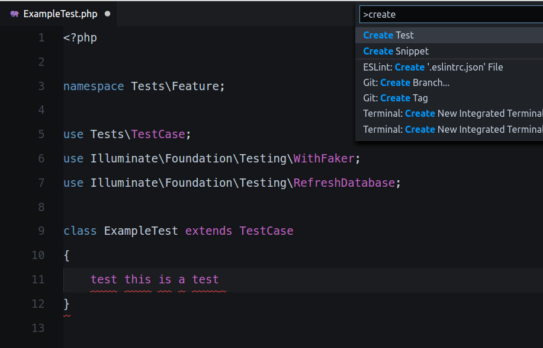
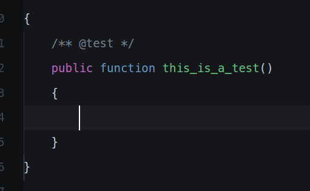
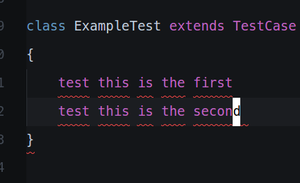
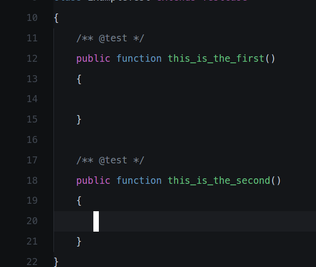

# PHP Test Creator README

Simple PHP Test Method Creator

## Features

Describe specific features of your extension including screenshots of your extension in action. Image paths are relative to this README file.

For example if there is an image subfolder under your extension project workspace:

> Tip: Many popular extensions utilize animations. This is an excellent way to show off your extension! We recommend short, focused animations that are easy to follow.

## Requirements

None.

## Extension Settings

* `phpTestCreator.withoutExceptionHandling.visiblity`: show/hide withoutExceptionHandling

## Known Issues

None

## Release Notes

### 1.0.0

Initial release
